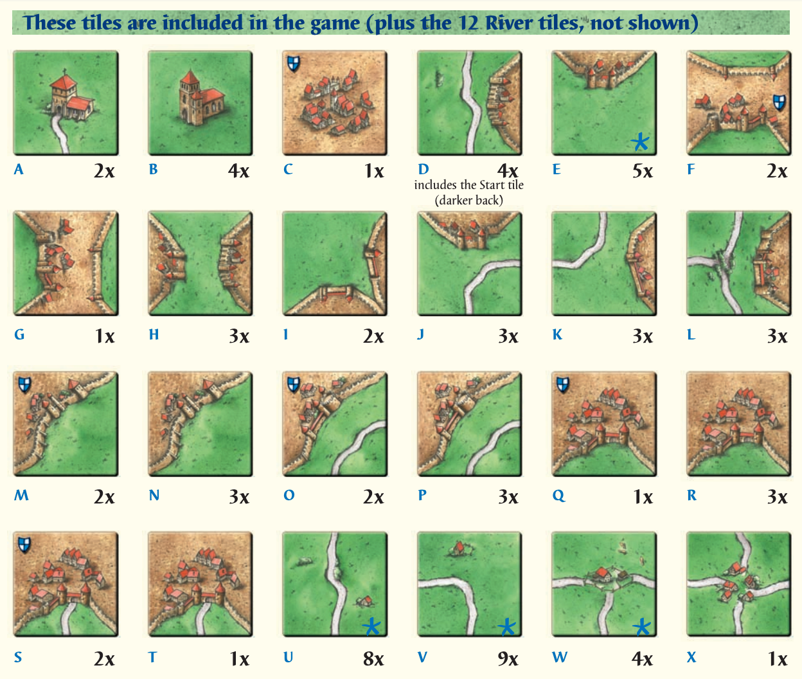
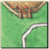
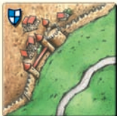
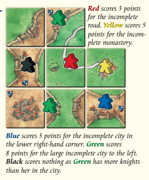
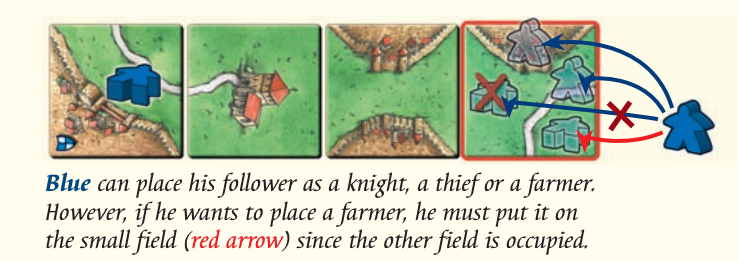
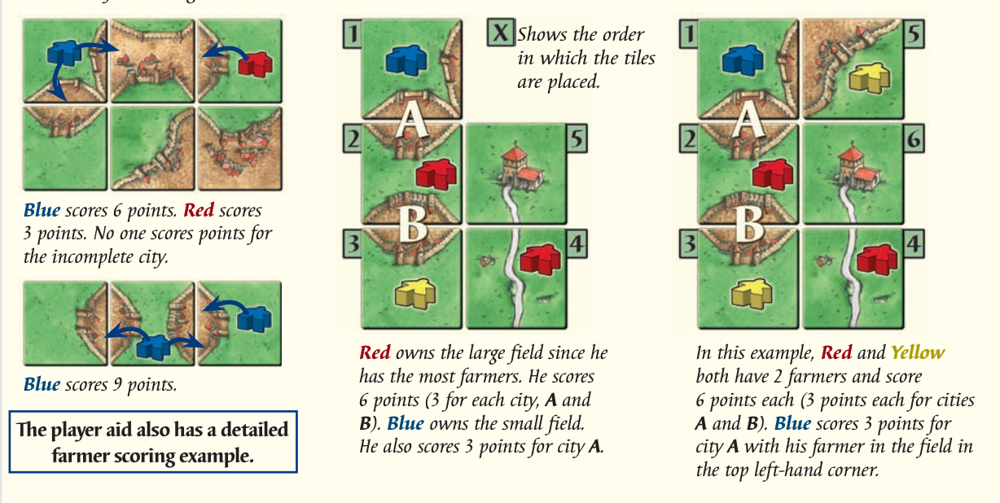
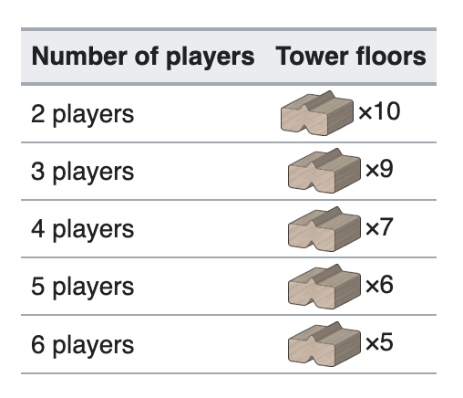

# What is SYNCS Bot Battle?
Bot Battle is a programming competition that challenges students to systematically solve a video game with an automated solution while competing with other students. The goal is to test student’s programming ability and devise clever solutions to complex problems in a competitive and fun environment.

# Game Outline

Carcassonne is a medieval, fortified city in southern France that is famous for its walls. The eponymous game is a tile placing game where players compete to reach 50 points first by developing their own medieval empires. To gain points, players must place tiles to complete claimed territories, including roads, cities and monasteries. As a player, you will develop a bot to manage your meeples, strategically construct territories and block opponents from completing their own.

This implementation is heavily based on the board game by Klaus-Jürgen Wrede. Here is the link for the manual from which we have derived our rules: [here](https://fgbradleys.com/wp-content/uploads/rules/Carcassonne-rules.pdf?srsltid=AfmBOor_qgjRo0ozc-OzdrNgE9kfg3OxtT4fyvfkYiT3SjcbY8w0PLZx). Please note that there are several variations of the base game. In the SYNCS implementation, we will initially be using the river expansion for the set up phase, and valid territories include roads, towns and monasteries. As the Bot Battle progresses, we will gradually add more features you need to consider, such as farms and towers.

Whether you are an amateur king or a seasoned emperor, we understand that Carcassonne can take some getting used to, so, if you have any questions regarding the rules or outcomes of any edge cases, please ask away on our Discord. We are more than happy to help!

# Game Equipment
## Tiles
The gameboard for Carcassonne is unique in that it is created dynamically as each game progresses. During each player's turn, they will draw a tile from the pile and place it in a valid position. In total there are 72 land tiles and 12 river tiles. Each tile can display a river, a section of a city, a section of a road, or a monastery.

Note that tiles *W* and *X* depict road-ends and *A* and *B* are monasteries. Every other tile depicts roads and/or towns.

## Meeples
These are the tokens representing a player's claim over a territory. Each player has 7 meeples, meaning that at any given time, they can claim at most 7 unfinished territories. Once a territory is complete, the meeple is returned to the player and they can use it to claim something else in their next turn. If you run out of meeples, you will not be able to claim any new territories until you have completed a previous territory.

## Scorecard
Represents every players’ current score. The scorecard is updated whenever a territory is completed.

# Game Setup
Once meeple have been allocated, the setup phase of the game will commence. The starting river tile is placed on the board. Then, each player draws another river tile, and then places it as they wish as long as the river is maintained as a contiguous stream. You may **not** place a river tile in a way such that it forms a u-turn. Once the tile denoting the river’s end is drawn and placed, the setup phase concludes.

As seen above, river tiles may also contain monasteries, cities or roads. If such a card is drawn and placed you will be able to place a meeple and claim it, if you desire. 

For more specific rules on the river, please feel free to check the rules [here](https://wikicarpedia.com/car/River). Note that we are **not** using *The River II*.

# Game Mechanics
## A Player’s Turn

During a player’s turn, they will draw a land tile from the deck. At any point, a player can have at most 3 tiles in their hand. Then, they will place one of the tiles on the board, such that it has at least one adjacent tile and all constraints placed on the tile by its neighbours are met. 

For example, let’s consider tile *J* depicted above (as denoted under [Tiles](#tiles))

Valid placements could include:

- To the left or above tile *K*
- Under tiles *C* or *G*
- To the right of tiles *B* or *E*
- Above tile *U*

Please note that the above is a non-exhaustive list of valid placements. Tiles can be placed in any orientation as long as it fits the criteria. For example, if you rotate *J* 90 degrees to the right, it can be placed to the left of *H*.

Once a tile has been placed, the player has the option to use one of their meeples to claim a territory only upon the placed tile. They can only claim a territory if it hasn’t been previously claimed by themselves or another player. For example, if a tile is placed such that a road is now connected to a road that already exists and is claimed by another player, you will not be able to claim it.

If a placed tile creates two unclaimed territories, such as a road and a town, you may claim at most one of those territories on your turn.

### No Valid Placements

In the (very unlikely) scenario that none of the tiles in your current hand can be placed in any valid position,
you may choose one of your tiles to discard and replace with a new tile in the deck.

## Completing a Territory

### Roads
Roads are completed when it has a defined start and end (these can be towns, monasteries or the road-ends) with no gaps or a loop has been formed. Once you have completed a road, you gain 1 point per tile.

### Towns
Towns are completed when it is surrounded by walls and there are no gaps in the walls or the town. Once you have completed a town, you gain 2 points per tile. Some town tiles also possess a banner, as shown below.

For every tile in your town that has a banner, you will receive an additional 2 points.

### Monasteries
Monasteries are completed when the monastery tile is surrounded by 8 tiles. Once you have completed a monastery, you gain 9 points (1 per tile).

Situations can arise where a tile is placed that connects towns/road segments claimed by different players. If such a situation arises, the player that has more meeples on that territory will claim the points. If both players have an equal stake, they shall both receive the points.

## Ending the Game
The game ends as soon as a player gains 50 or more points. At this point, no more tiles will be placed, and final scores will be tallied. There are points allocated for incomplete territories.

For every tile that comprises your incomplete territory, you will receive 1 point (with an additional point for every town tile with a banner). An example has been included below.

Note that if Black had an additional meeple on the town, both Green and Black would have received 8 points.

Once all points have been tallied, the winner is the player with the most points. Therefore, as a player, it is important to note that being the first one to reach 50 points, does not guarantee your victory.

# Additional Territories
## Fields and Farmers
You will notice on the tiles that aside from roads or towns, there are also large green fields that, throughout the progression of the game, merge to form large farmlands. In this expansion, these fields are now considered valid territories.

When you play a tile, you now have the ability to place a meeple on a field, provided it hasn’t been claimed previously. Fields are separated by roads, towns and the edge of the board.

In the above example, we see that if Blue wants to place a meeple as a farmer, they can only place it in the bottom right corner of the tile as the rest of the field has already been claimed by Blue previously. You will also notice that the meeple has been placed flat on the ground, as opposed to standing up. This denotes that it is a farmer.

Unlike the other territories seen previously, fields are **not** scored during the game. This means that once you place a farmer, you will not be able to reclaim the meeple until the end of the game.

Then, once the game is complete, you will examine the farmland for each farmer. For every **completed city** that borders a field, regardless of size or distance, the player with the most farmers on that field receives 3 points.

## Towers
Throughout your conquest, you have grown tired of pesky meeples diminishing your stakes in territory. So, to combat this insurgence, you decide to construct towers to capture enemy meeples and hold them for ransom! 

### Equipment
Introduced are 18 land tiles which possess a tower foundation. These tiles may also have roads or cities. Each player is also allocated a set number of tower floors they can use through the game.

### Functionality
After a player places a tile, they now have a choice of options.
Claim a territory on the placed tile
Use one of their floors to create a foundation for an unstarted tower
Add a floor to a started, unfinished tower
Place a meeple on a started tower, completing it.

Every time a floor is added to a tower, the player may remove one meeple off the board, including one of their own. However, the range in which they can remove meeples depends on the height of the tower. For example, a tower with a height of 2 could remove a meeple lying within 2 tiles in each cardinal direction from the tower, giving you access to 9 tiles, if you include the tower tile as well. This reach passes over any empty tiles and towers (i.e. you can remove the meeple off a closed tower regardless of the tower’s height, so long as the reach is sufficient. This reopens that tower.)

If the meeple you remove is your own, you can add it back to your supply and use it to claim another territory in the future. If it is an opponent’s meeple, this meeple is now your prisoner. The only ways to reclaim a prisoner are through trading (if you possess one of your opponent’s meeples, you can swap them and return your meeple to your supply), or by paying the ransom of 3 points. Note that if you do not have sufficient points, you are unable to pay the ransom.

If you decide to complete a tower by placing a meeple on it, it will remain there for the rest of the game, or until it is captured by a rivalling tower. This is primarily to keep your own meeples safe.

Towers themselves offer no points at the end of the game.

More detailed rules can be found [here](https://wikicarpedia.com/car/The_Tower).

# Your Implementation
You are required to create a bot player to strategically run through the game and compete with other bots to create your own medieval empire or ruin the attempts of your opponents, whilst adhering to the rules of the game. Good luck!

